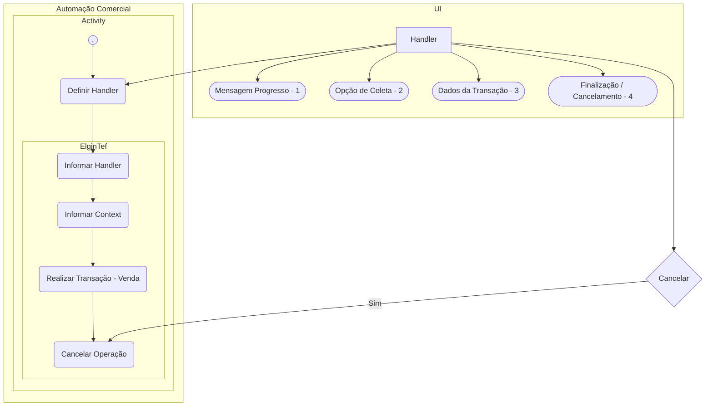

```mermaid
flowchart TB

    subgraph ac [Automação Comercial]
    direction TB
        subgraph act [Activity]
            direction TB
            actb((.))
            dh(Definir Handler)
                subgraph et [ElginTef]
                    direction TB
                    ih(Informar Handler)
                    ic(Informar Context)
                    rt(Realizar Transação - Venda)
                    co(Cancelar Operação)
                end
        end
    end

    c{Cancelar}

    subgraph UI
    direction LR
        h[Handler]
        mp([Mensagem Progresso - 1])
        oc([Opção de Coleta - 2])
        dt([Dados da Transação - 3])
        fc([Finalização / Cancelamento - 4])
    end


    actb --> dh
    dh --> ih
    ih --> ic
    ic --> rt
    rt --> co
    h --> mp
    h --> oc
    h --> dt
    h --> fc
    c -->| Sim | co
    h --> c
    h --> dh
```